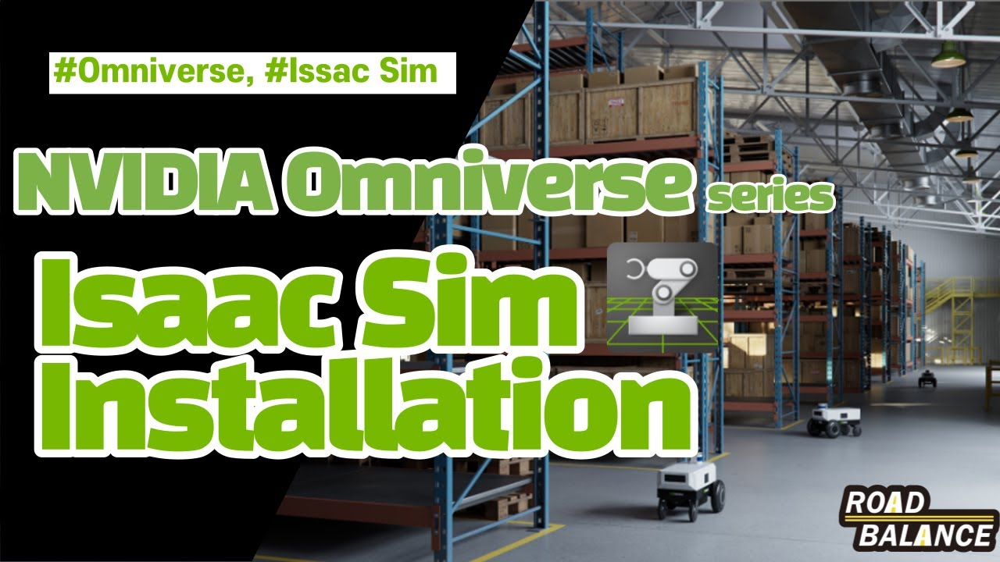
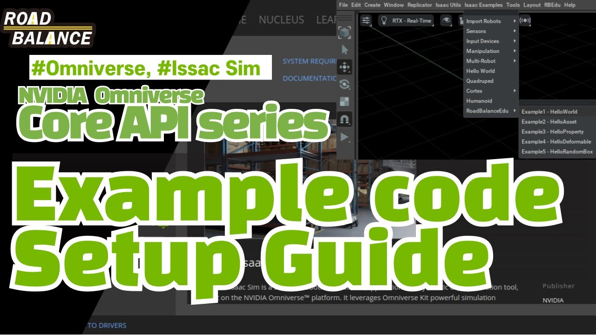
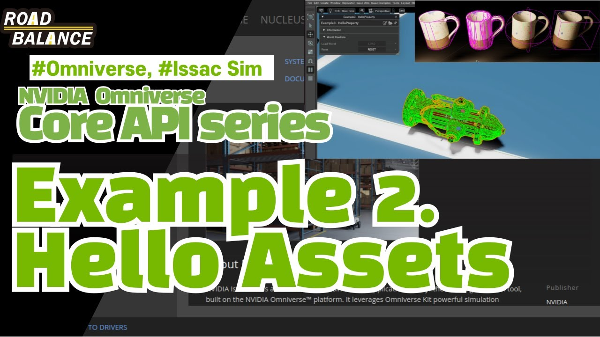
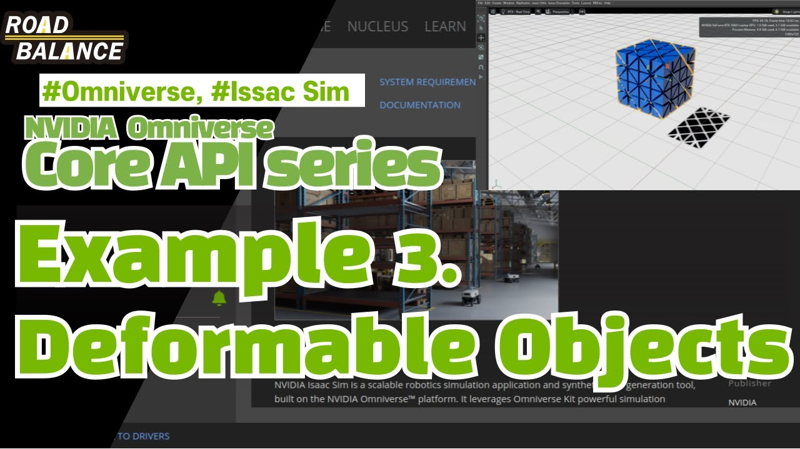
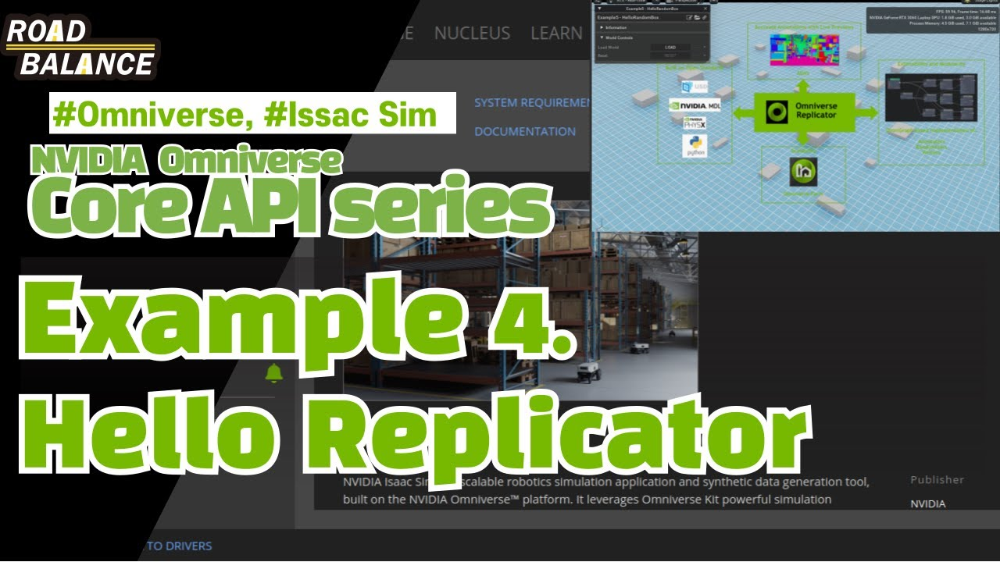
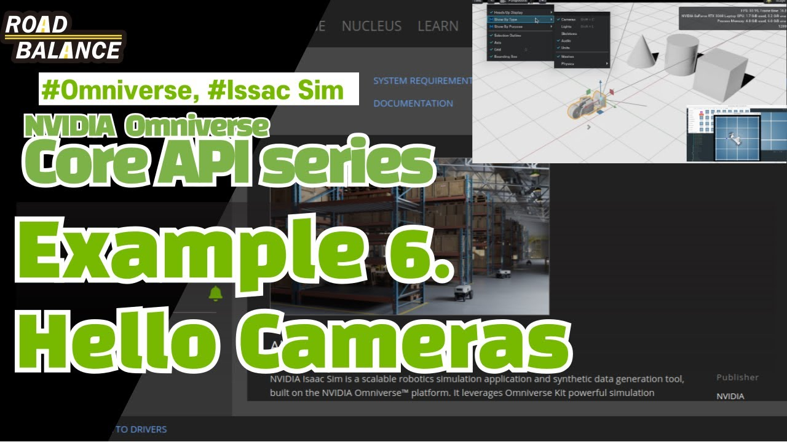
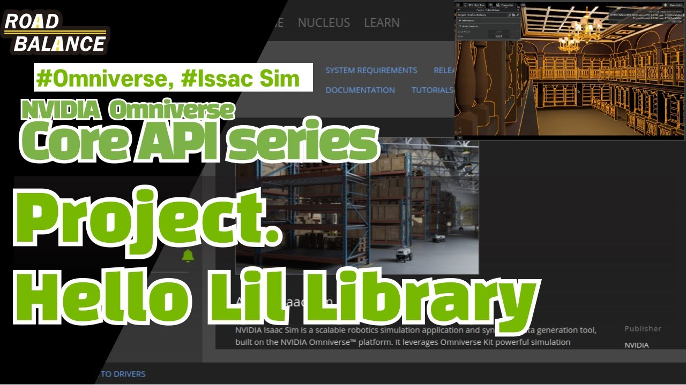
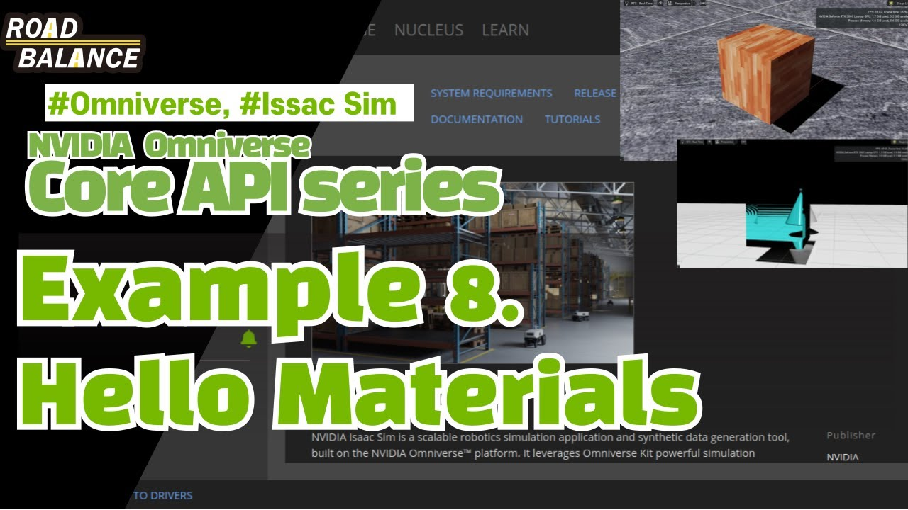
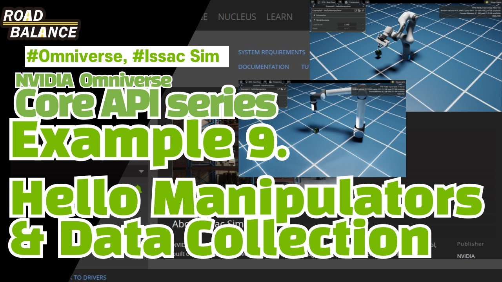

# RBEdu - Robotics Education Examples

A collection of educational examples for learning robotics simulation using NVIDIA Isaac Sim.

## ⚙️ Installation

1. Install NVIDIA Isaac Sim following my YouTube Video: *[OMNIVERSE] NVIDIA Omniverse Isaac Sim Installation for Robotics Software Engineers*

<p align="center">
    <a href="https://www.youtube.com/watch?v=ZUX9SrPGrbk" target="_blank">
        
    </a>
</p>

2. Clone this repository:

```
bash
git clone https://github.com/kimsooyoung/rb_isaac_edu.git
cd RBEdu
```

3. Enable the extension in Isaac Sim by following my YouTube Video: *[Isaac Sim Tutorial - Core API] Introduction to Lecture Code Setup*

<p align="center">
    <a href="https://www.youtube.com/watch?v=hP01sOYtXKM" target="_blank">
        
    </a>
</p>

## ▶️ Youtube Video and Examples (Click the image for watching!)

### 1. Hello World
Basic example demonstrating Isaac Sim setup and usage.
<p align="center">
    <a href="https://www.youtube.com/watch?v=yJwdIx9KEfw" target="_blank">
        
    </a>
</p>

### 2. Hello Asset
Learn how to load and manipulate 3D assets in the simulation.
<p align="center">
    <a href="https://www.youtube.com/watch?v=ZGdoFgekXO4" target="_blank">
        
    </a>
</p>

### 3. Hello Deformable
Introduction to deformable object simulation.
<p align="center">
    <a href="https://www.youtube.com/watch?v=lnpb3DYyWxM" target="_blank">
        
    </a>
</p>

### 4. Hello Replicator
Learn environment randomization techniques.
<p align="center">
    <a href="https://www.youtube.com/watch?v=L9DA48mt318" target="_blank">
        
    </a>
</p>

### 5. Hello Light
Lighting setup and manipulation in Isaac Sim.
<p align="center">
    <a href="https://www.youtube.com/watch?v=-1AV2jTG5gg" target="_blank">
        
    </a>
</p>

### 6. Hello Camera
Camera setup and configuration examples.
<p align="center">
    <a href="https://www.youtube.com/watch?v=DqzGuXXrHIA" target="_blank">
        
    </a>
</p>

### 7. Project - Hello Lil Library
Small project for practicing Core APIs.
<p align="center">
    <a href="https://www.youtube.com/watch?v=N-11N90jjiU" target="_blank">
        
    </a>
</p>

### 8. Hello Material
Special Materials from Omniverse, including MDL, OmniGlass.
<p align="center">
    <a href="https://www.youtube.com/watch?v=5VGCVoD4eOs" target="_blank">
        
    </a>
</p>

### 9. Hello Manipulator
Robot arm manipulation examples.
<p align="center">
    <a href="https://www.youtube.com/watch?v=5VGCVoD4eOs" target="_blank">
        
    </a>
</p>

### 9. Hello Defect Object
Defect detection simulation with:
- Circuit board inspection
- Semantic labeling
- Robot interaction
- Vision data collection

### 10. Environment Randomization
Advanced environment randomization with:
- Dynamic object placement
- Lighting variation
- Camera positioning
- Physics properties

## Project Structure

```
RBEdu
├── RBEdu_python
│   ├── HelloWorld
│   ├── HelloAsset
│   ├── HelloProperty
│   ├── HelloDeformable
│   ├── HelloRandomBox
│   ├── HelloLight
│   ├── HelloCamera
│   ├── ...
``` 

## Contributing

1. Fork the repository
2. Create your feature branch (`git checkout -b feature/amazing-feature`)
3. Commit your changes (`git commit -m 'Add amazing feature'`)
4. Push to the branch (`git push origin feature/amazing-feature`)
5. Open a Pull Request

## License

This project is licensed under the Apache License 2.0 - see the LICENSE file for details.

## Acknowledgments

- NVIDIA Isaac Sim team
- Road Balance Inc.